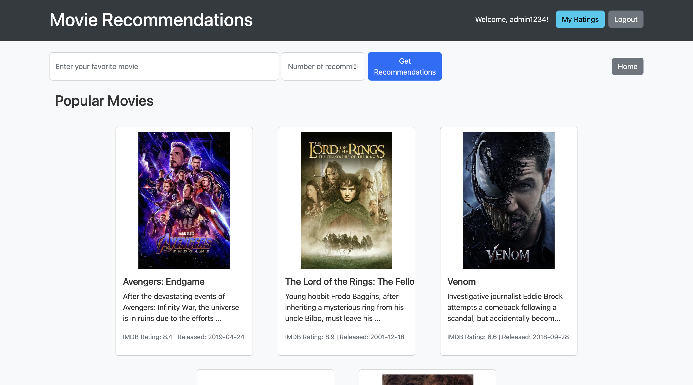
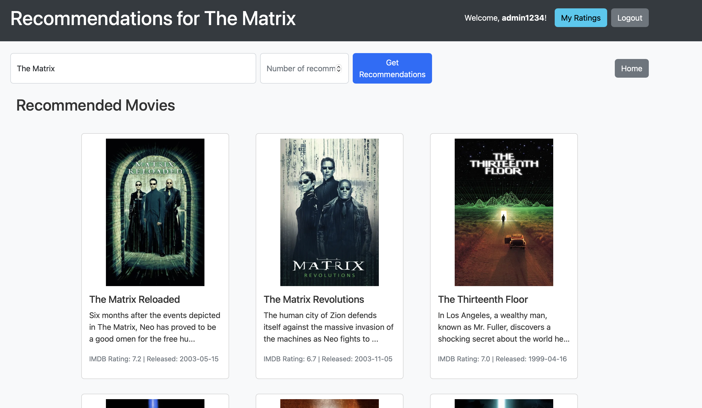
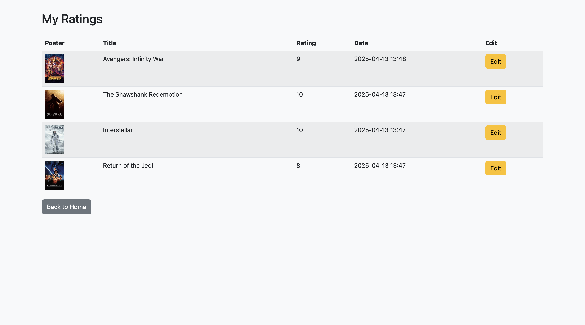
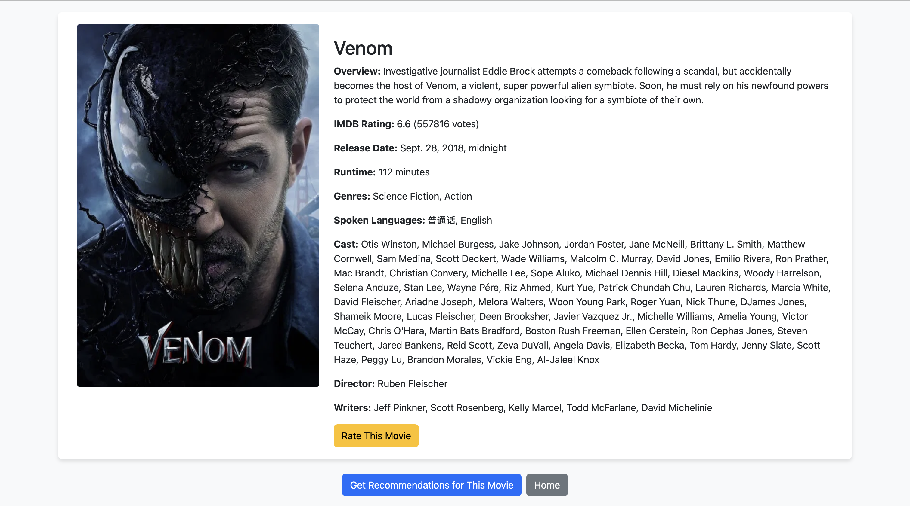
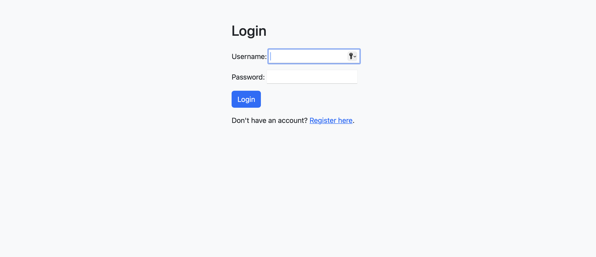
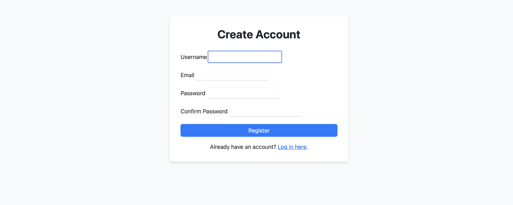

# Movie Recommendation System using Machine Learning

**A movie recommendation system using collaborative filtering (SVD), content-based filtering (TF-IDF), and a hybrid approach, with a Django web app for interaction.**

[](https://opensource.org/licenses/MIT) []() []()

## Table of Contents

* [Overview](#overview)
* [Features](#features)
* [Methodology](#methodology)
    * [Data Sources](#data-sources)
    * [Data Processing](#data-processing)
    * [Recommendation Algorithms](#recommendation-algorithms)
* [Project Structure](#project-structure)
* [Setup and Installation](#setup-and-installation)
* [Usage](#usage)
* [Screenshots](#screenshots)


## Overview

This project builds a movie recommendation system designed to give personalized suggestions. It uses large datasets (MovieLens 32M and The Ultimate 1 Million Movies) and combines different techniques:

1.  **Collaborative Filtering:** Uses SVD (via `scikit-surprise`) based on user ratings.
2.  **Content-Based Filtering:** Uses TF-IDF and Cosine Similarity on movie descriptions/genres (via `scikit-learn`).
3.  **Hybrid Approach:** Mixes both methods for potentially better results.

The system offers recommendations based purely on content similarity and also using the hybrid model. It's all wrapped up in a Django website where users can sign up, log in, rate movies, and get their recommendations.

## Features

* **Handles Large Datasets:** Works with MovieLens 32M and Ultimate 1 Million Movies data.
* **Data Processing:** Includes steps for cleaning data, exploring it (EDA), and preparing features.
* **Recommendation Models:**
    * Collaborative Filtering (SVD).
    * Content-Based Filtering (TF-IDF & Cosine Similarity).
    * Hybrid strategy.
    * Separate Content-Based Similarity results.
* **Django Web App:**
    * User Login/Register.
    * Browse movies.
    * Rate movies.
    * See personalized recommendations.
* **Saved Models:** Uses `pickle` to save trained models for quick use.

## Methodology

### Data Sources

* **[MovieLens 32M Dataset](https://grouplens.org/datasets/movielens/32m/):** ~32 million ratings for ~86,000 movies.
* **[The Ultimate 1 Million Movies Dataset (TMDb + IMDb)](https://www.kaggle.com/datasets/alanvourch/tmdb-movies-daily-updates?resource=download):** Metadata for over 1 million movies.

### Data Processing

1.  **Gathering:** Loading data with Pandas.
2.  **Cleaning:** Fixing missing values, duplicates, etc.
3.  **EDA:** Using Matplotlib/Seaborn to understand the data visually.
4.  **Feature Engineering:** Processing text for content-based filtering, structuring data for CF.

### Recommendation Algorithms

* **Collaborative Filtering (SVD with `scikit-surprise` 1.1.4):** Finds patterns in user ratings using Matrix Factorization (SVD) to predict what a user might rate a movie.
* **Content-Based Filtering (TF-IDF & Cosine Similarity with `scikit-learn` 1.6.1):** Processes movie text (plots, genres) using TF-IDF to create vectors. Recommends movies with similar vectors (high Cosine Similarity) to ones the user likes. Uses `nltk` for text preprocessing.
* **Hybrid Approach:** Combines the predictions/rankings from CF and CBF.

## Project Structure

```
├── data (Contains all csv files need for the project. Created by the notebook.)
├── Ml notebook
├── saved_models
├── MovieProject
│   ├── __innit__.py
│   ├── asgi.py
│   ├── urls.py
│   ├── wsgi.py
│   └── settings.py
├── recommendations
│   ├── ml_models
│   ├── templates
│   ├── migrations
│   ├── __innit__.py
│   ├── admin.py
│   ├── cosine_recommender.py
│   └── ...
├── proj_env (Virtual Environment)
├── manage.py
└── screenshots
```

## Setup and Installation

1.  **Clone the Repository in Your Directory:**
    ```bash
    git clone https://github.com/stfntbkv/Movie-Recommendation-System.git
    ```

2.  **Create and Activate Virtual Environment (Recommended):**
    ```bash
    # Ensure you have a compatible Python 3.x version installed
    python -m venv venv
    # Windows
    # venv\Scripts\activate
    # macOS/Linux
    # source venv/bin/activate
    ```

3.  **Install Dependencies:**
    ```bash
    pip install -r requirements.txt
    ```
    *(This will install all packages including Django 5.1.6, scikit-surprise 1.1.4, etc.)*

4.  **Obtain Datasets:**
    * Download the MovieLens Latest Full dataset and place the relevant files (e.g., `ratings.csv`, `movies.csv`) inside the `data/` directory.
    * Download The Ultimate 1 Million Movies Dataset and place it in the `data/` directory.

5.  **Get Pre-trained Models:**
    * The pre-trained models required to run the web application are hosted on Google Drive.
    * **Download the model files from:**
        * [Pre-trained models](https://drive.google.com/drive/folders/19-hgxOFR1LY6Q3jrR2njuZvkr1S2hUwG?usp=share_link)

    * **Place the downloaded file(s)** inside the `saved_models/` directory in your project folder. Ensure the filenames match what the application expects (e.g., `svd_model.joblib`, `tfidf_vectorizer.joblib`).


6.  **Configure Django Application:**
    * Navigate to the Django project directory: `cd webapp`
    * Apply database migrations:
        ```bash
        python manage.py migrate
        ```

7.  **Run the Development Server:**
    ```bash
    python manage.py runserver
    ```

8.  Open your web browser and navigate to `http://127.0.0.1:8000/`.

## Usage

1.  Access the web application via `http://127.0.0.1:8000/`.
2.  Use the **Register** page to create a new user account.
3.  **Login** using your credentials.
4.  **Browse** the movie catalog. Detailed pages might show movie information and potentially content-based similar movies.
5.  **Rate** movies using the provided interface. Your ratings help personalize collaborative filtering recommendations.
6.  Check the dedicated **Recommendations** page or section to view movies suggested by the hybrid model. Content-based recommendations might appear on individual movie pages or another section.

## Screenshots

### Homepage


### Recommendations Page


### Movie Ratings/Movie Info



### Login/Register


